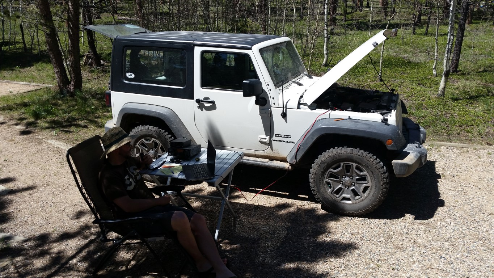

---
hide:
  - toc
---

# About

My interest in amateur radio began in 2013 when I was living in Colorado Springs. I had no idea this whole other world existed, and once I started learning about it I knew I had to get involved. I studied for the Technician exam and found a session being offered at a local church. I went in one Saturday and passed both the Technician and General exams, and was issued the callsign KE0BUI.

After a year of making contacts, a lot of listening, and even more studying, I upgraded my license to Amateur Extra in Fort Collins and was issued the callsign AD0OW. I used mainly the 2m and 70cm bands during this time with a Yaesu FT60R handie-talkie. I got to know the folks at the CSU Amateur Radio Club and learned a lot about repeaters. We overhauled the W0QEY repeater on the CSU campus for the first time in 30 years!

I requested a vanity callsign from the FCC and received NV9P on May 29, 2015. I work the 40m and 20m bands on phone and PSK31. Lately I've been researching antenna options to expand my band capabilities and range.

73,
Casey
NV9P

