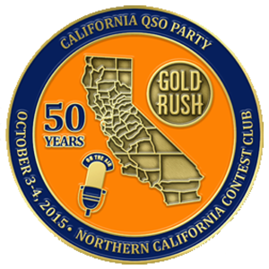
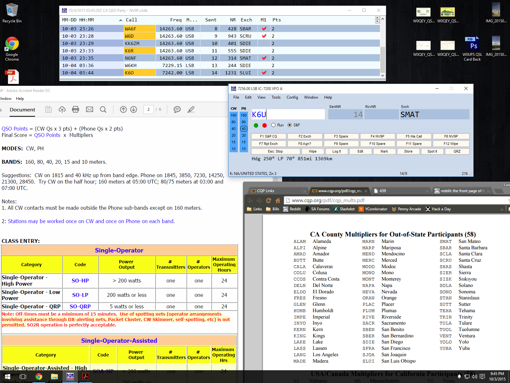

---
date:
  created: 2015-10-05
readtime: 10
pin: true
links:
  slug: contest
---

# California QSO Party 2015

Being my first radio contest I think it went quite well. I ended up only making 34 contacts over a 24 hour period but it was still fun. Mind you this was between doing other things, not just me glued to the chair all day and night. I'd wander in and out and depending on the band conditions I'd sit down for 15 minutes and log a few contacts.

<!-- more -->

The real interesting part about the contest was the logging software that I used. It's a program called N1MM+ logger but it made the scoring, exchanges and tracking everything so easy and streamlined. For all these contests they release a contest specific file you upload into N1MM+ that guides you through the contest. For example I had to contact a California station, get their serial number and four digit municipality like SDIE for San Diego and give them an incremented serial number from my station to complete the contact. The radio has a USB to the computer so it has the frequency, mode and time already filled in. I typed their call into the software, it auto-incremented the serial, discovered the municipality and hit enter. Done.

To add a little more incentive to the contest they had 36 special stations scattered throughout the state that had the letters in their callsign to spell GOLDRUSH. If you spelled it out in your logged contacts they would send you a QSO party commemorative coin. N1MM+ would flag those callsigns as I contacted them (based on that contest file upload) and I could track my progress. I think I ended up with GOLDR__H ha.

The tricky part of the contest was scanning the bands to try and find these people to contact. Plus the fact that I have a wire antenna strung up in the yard didn't help much. But when I found the contesters they usually came in loud and clear. I stumbled upon this neat tool called a spotting network that helps find contacts. Usually they use it for DX spotting but they had a contest spotting one too. Another tool built into that N1MM+ software, it actually uses telnet and you connect to a chat room of sorts and as other people log contacts in N1MM+ it automatically sends the calls, frequency, time, distance and more to this spotting network and N1MM+ puts a "spot" in your own program. When you see the spots you click them, the radio tunes to the right mode and frequency and you hope your antenna can hear them!

About the time I got tired of repeating the same stuff in the radio "CQ California, CQ California, this is NV9P calling all California stations for the QSO Party" I discovered they have macro functions built into the software with one button recording! I pimped out all my macros and made it a lot smoother. At this point between the logging, spotting network and macros it was mostly automated. There was a guy online that recorded all the numbers and letters individually and he could fully automate the whole exchange which I thought was funny.

The final piece was after the contest ended Sunday afternoon, you close out your log in N1MM+ and export a Cabrillo format log of all your contacts. This is the standardized format so I exported that real quick and they have a webpage on the California QSO Party website where you upload your file. Took 5 seconds and my scores were in the books. They have a 7 day grace period to give everyone a chance to upload. It figured out the multipliers, the point value per contact and calculated it all correctly. in a nice neat text file.

I submitted as a solo operator but they have mobile, low power, multi-op, rookie and other categories to give everyone a chance to win something.

