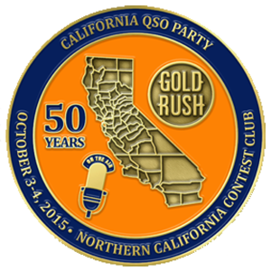
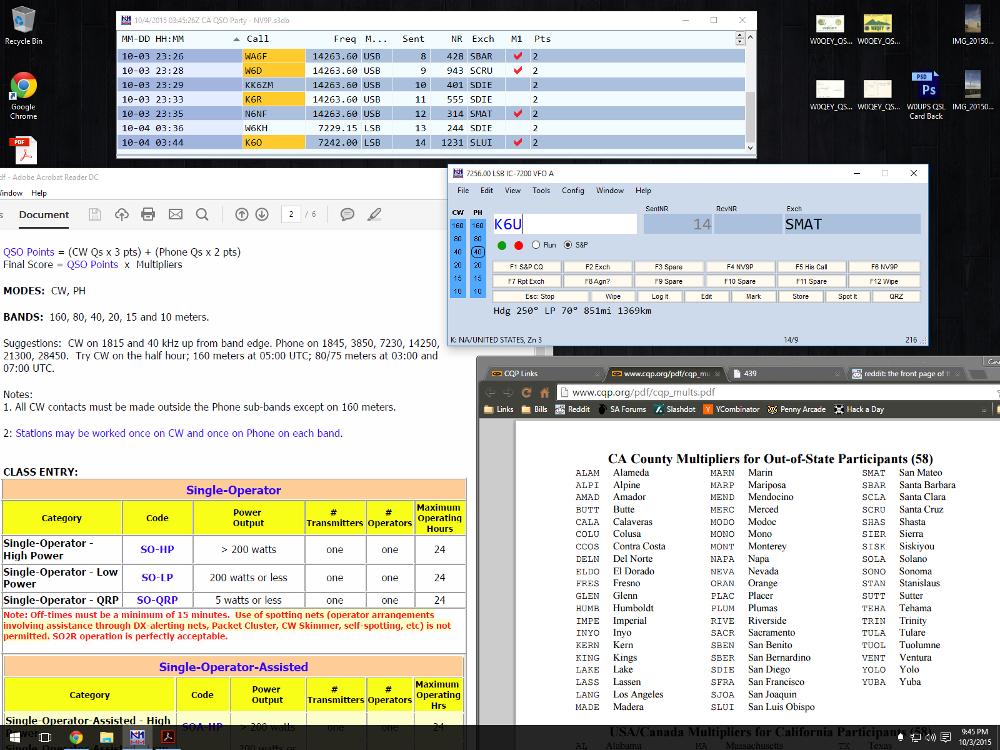

# California QSO Party 2015

Being my first radio contest, I think it went quite well. I ended up making 34 contacts over a 24-hour period, which was still fun. Mind you, this was between doing other things — not just me glued to the chair all day and night. I'd wander in and out, and depending on band conditions I'd sit down for 15 minutes and log a few contacts.

<!-- more -->

The really interesting part of the contest was the logging software. It's a program called N1MM+ Logger, and it made the scoring, exchanges, and contact tracking incredibly streamlined. For each contest they release a contest-specific file you upload into N1MM+ that guides you through the whole thing. For example, I had to contact a California station, get their serial number and four-digit municipality code like SDIE for San Diego, and give them an incremented serial number from my station to complete the contact. The radio connects via USB to the computer, so the frequency, mode, and time are already filled in automatically. I typed their call into the software, it auto-incremented the serial, looked up the municipality, and I hit Enter. Done.

To add a little more incentive, the contest had 36 special stations scattered throughout the state whose callsigns spelled out GOLDRUSH. If you logged all of them, they'd send you a commemorative QSO party coin. N1MM+ flagged those callsigns as I contacted them based on the contest file upload, so I could track my progress. I think I ended up with GOLDR__H ha.

The tricky part of the contest was scanning the bands to find stations to work. The wire antenna strung up in my yard didn't help much either. But when I did find the contesters, they usually came in loud and clear. I stumbled onto this neat tool called a spotting network that helps locate contacts. Usually it's used for DX spotting, but there was a contest-specific one as well. It's another tool built into N1MM+ — it uses telnet to connect to a chat room of sorts, and as other people log contacts in N1MM+ it automatically pushes the call, frequency, time, distance, and more to the spotting network. N1MM+ then drops a "spot" into your own program. When you see a spot, you click it, the radio tunes to the right mode and frequency, and you hope your antenna can hear them!

About the time I got tired of repeating the same stuff into the radio — "CQ California, CQ California, this is NV9P calling all California stations for the QSO Party" — I discovered the software has macro functions with one-button recording! I loaded up all my macros and made the whole thing a lot smoother. At that point, between the logging, spotting network, and macros, it was mostly automated. There was a guy online who had recorded all the numbers and letters individually and could fully automate the whole exchange, which I thought was pretty funny.

The final piece: once the contest ended Sunday afternoon, you close out your log in N1MM+ and export a Cabrillo format file of all your contacts. It's the standardized log format, so I exported it quickly and uploaded it to the California QSO Party website. Took about five seconds and my scores were in the books. They have a seven-day grace period to give everyone a chance to submit. The system worked out the multipliers and point values and calculated everything correctly in a nice, clean text file.

I submitted as a solo operator, but they have mobile, low power, multi-op, rookie, and other categories to give everyone a shot at winning something.

