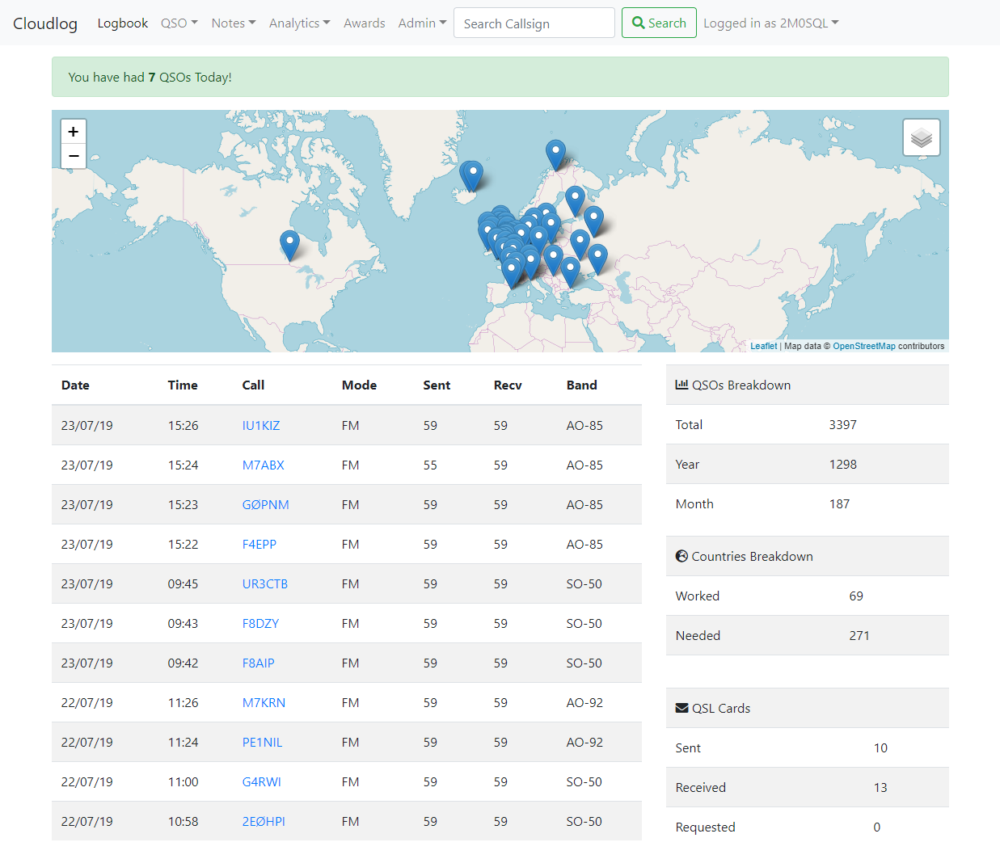

# Configuring Cloudlog on Debian



Cloudlog is an open-source, PHP and MySQL based amateur radio logging application that lets you log contacts through a web browser on any device and platform.

It's an ideal general-purpose logging application with support from HF to Microwave. It can interface with your radio via CAT, sync logs from WSJT-X, and if you're a satellite operator it integrates with SatPC32.

<!-- more -->

## Configuring Cloudlog on Debian

I ran Debian from an LXC container on my Proxmox host in my home network. This lets me run it on a low-power machine and back it up to my TrueNAS box as well. These steps assume you are on a Debian or Ubuntu install.

### 1. Install Nginx

Install the Nginx web server.

```$ sudo apt-get install nginx -y```

Start the Nginx service.

```$ sudo systemctl start nginx```

Enable the Nginx service to start at system reboot.

```$ sudo systemctl enable nginx```

Check the Nginx version to verify the installation.

```$ sudo nginx -v```

You should see output like this:

```$ nginx version: nginx/1.22.0```

### 2. Configure the Firewall

List the available application profiles.

```$ sudo ufw app list```

Among the other entries, you should see the following profiles:

```Nginx Full```
```Nginx HTTP```
```Nginx HTTPS```

!!! note

    The Nginx Full profile opens both HTTPS (443) and HTTP (80) ports.
    The Nginx HTTP profile opens the HTTP (80) port only.
    The Nginx HTTPS profile opens the HTTPS (443) port only.

Allow the Nginx Full profile in the firewall. Certbot requires ports 80 and 443 to install a Let's Encrypt TLS/SSL certificate.

```$ sudo ufw allow 'Nginx Full'```

Check the Firewall status.

```$ sudo ufw status```

    You should see output like this:

     To                         Action      From
     --                         ------      ----
     22                         ALLOW       Anywhere
     Nginx Full                 ALLOW       Anywhere
     22 (v6)                    ALLOW       Anywhere (v6)
     Nginx Full (v6)            ALLOW       Anywhere (v6)

### 3. Create an Nginx Virtual Host

Remove the default Nginx configuration.

```$ sudo rm -rf /etc/nginx/sites-enabled/default```
```$ sudo rm -rf /etc/nginx/sites-available/default```

Create an Nginx virtual host configuration file. Replace your-domain-name.com with your domain name.

```$ sudo nano /etc/nginx/sites-available/cloudlog.qth.nv9p.com```

Paste this into the file. Replace cloudlog.qth.nv9p.com with your domain name.

```bash
  server {
    
    listen       80;
    server_name  cloudlog.qth.nv9p.com;
    root         /var/www/html/;
    # Redirect all traffic to HTTPS
    return 301 https://$host$request_uri;    
    
    access_log /var/log/nginx/yourdomain.com-access.log;
    error_log  /var/log/nginx/yourdomain.com-error.log error;
    index index.php index.htm index.html;

    location / {
         try_files $uri $uri/ /index.php$is_args$args;
         }

    location ~ \.php {
         fastcgi_split_path_info ^(.+\.php)(/.+)$;
         fastcgi_pass unix:/var/run/php/php8.2-fpm.sock;
         fastcgi_index index.php;
         include fastcgi.conf;
      }
  }
  
  server {
    listen 443 ssl;
    server_name cloudlog.qth.nv9p.com;

    ssl_certificate /etc/letsencrypt/live/cloudlog.qth.nv9p.com/fullchain.pem; # managed by Certbot
    ssl_certificate_key /etc/letsencrypt/live/cloudlog.qth.nv9p.com/privkey.pem; # managed by Certbot
    include /etc/letsencrypt/options-ssl-nginx.conf; # managed by Certbot
    ssl_dhparam /etc/letsencrypt/ssl-dhparams.pem; # managed by Certbot
    
    root /var/www/html/;  # Path to your application files

    # Redirect root path to /index.php/user/
    location = / {
        return 301 /index.php/user/;
    }

    location / {
        try_files $uri $uri/ /index.php?$query_string;
    }
    
    location ~ \.php {
         fastcgi_split_path_info ^(.+\.php)(/.+)$;
         fastcgi_pass unix:/var/run/php/php8.2-fpm.sock;
         fastcgi_index index.php;
         include fastcgi.conf;
    }
}       
```

Enable the new Nginx configuration. Replace example.com with your domain name.

```$ sudo ln -s /etc/nginx/sites-available/example.com /etc/nginx/sites-enabled/cloudlog.qth.nv9p.com```

Reload the Nginx service.

```$ sudo systemctl reload nginx```

### 4. Install MariaDB

Install MariaDB database server.

```$ sudo apt-get install mariadb-server -y```

Start the MariaDB service.

```$ sudo systemctl start mariadb```

Enable the MariaDB service to start at system reboot.

```$ sudo systemctl enable mariadb```

### 5. Secure MariaDB Database Server

MariaDB provides a security script to secure the database. Run it and answer all the security questions as shown.

```$ sudo mysql_secure_installation```

```bash
Initially, there is no password for root. Press Enter.

Enter current password for root (enter for none):
OK, successfully used password, moving on...

Press Y to Switch to unix_socket authentication.

Switch to unix_socket authentication [Y/n] Y
Enabled successfully!
Reloading privilege tables..
... Success!

Press Y to change the root password.

Change the root password? [Y/n] Y
New password:
Re-enter new password:
Password updated successfully!
Reloading privilege tables..
... Success!

Press Y to remove anonymous users.

Remove anonymous users? [Y/n] Y
... Success!

Press Y to remove remote root login.

Disallow root login remotely? [Y/n] Y
... Success!

Press Y to remove test database and access to it.

Remove test database and access to it? [Y/n] Y
- Dropping test database...
... Success!
- Removing privileges on test database...
... Success!

Press Y to reload the privilege tables.

Reload privilege tables now? [Y/n] Y
... Success!

Cleaning up...

All done! If you've completed all of the above steps, your MariaDB
installation should now be secure.

Thanks for using MariaDB!

Connect to the MariaDB shell and enter your MariaDB root password.

  $ sudo mysql -u root -p

Check the MariaDB version to verify the installation.

  MariaDB [(none)]> SELECT @@version;

  It should return something like this:
  +---------------------------+
  | @@version                 |
  +---------------------------+
  | 10.5.12-MariaDB-0+deb11u1 |
  +---------------------------+
  1 row in set (0.000 sec)

  Exit MariaDB shell.

  MariaDB [(none)]> exit
```

### 6. Install PHP

Install PHP-FPM 8.2 and other required packages.

```$ sudo apt-get install php php-fpm php-curl php-cli php-zip php-mysql php-xml -y```

Check the PHP version to verify the installation.

```$ php -v```

It should return something like this:

```bash
PHP 8.2.20 (cli) (built: Jun 17 2024 13:33:14) (NTS)
Copyright (c) The PHP Group
Zend Engine v4.2.20, Copyright (c) Zend Technologies
    with Zend OPcache v8.2.20, Copyright (c), by Zend Technologies
```
Start the PHP-FPM service depending on your installed PHP version. For example, PHP 8.2.

```$ sudo systemctl start php8.2-fpm```

Enable PHP-FPM to start automatically at system boot.

```$ sudo systemctl enable php8.2-fpm```

View the PHP-FPM service status and verify that it's running.

```$ sudo systemctl status php8.2-fpm```

### 7. Installing Certbot

The first step to using Let’s Encrypt to obtain an SSL certificate is to install the Certbot software on your server.

Install Certbot and its Nginx plugin with apt:

```sudo apt install certbot python3-certbot-nginx```

Certbot is now ready to use. In order for it to automatically configure SSL for Nginx, you'll need a valid domain pointed at your server.

### 8. Obtaining an SSL Certificate

Certbot provides a variety of ways to obtain SSL certificates through plugins. The Nginx plugin will take care of reconfiguring Nginx and reloading the config whenever necessary. To use this plugin, type the following:

```sudo certbot --nginx -d cloudlog.qth.nv9p.com -d cloudlog.qth.nv9p.com```

This runs certbot with the --nginx plugin, using -d to specify the domain names we’d like the certificate to be valid for.

If this is your first time running certbot, you will be prompted to enter an email address and agree to the terms of service. After doing so, certbot will communicate with the Let’s Encrypt server, then run a challenge to verify that you control the domain you’re requesting a certificate for.

The configuration will be updated, and Nginx will reload to pick up the new settings. certbot will wrap up with a message telling you the process was successful and where your certificates are stored:

```bash
IMPORTANT NOTES:
 - Congratulations! Your certificate and chain have been saved at:
   /etc/letsencrypt/live/example.com/fullchain.pem
   Your key file has been saved at:
   /etc/letsencrypt/live/example.com/privkey.pem
   Your cert will expire on 2022-08-08. To obtain a new or tweaked
   version of this certificate in the future, simply run certbot again
   with the "certonly" option. To non-interactively renew *all* of
   your certificates, run "certbot renew"
 - If you like Certbot, please consider supporting our work by:

   Donating to ISRG / Let's Encrypt:   https://letsencrypt.org/donate
   Donating to EFF:                    https://eff.org/donate-le
```

Your certificates are downloaded, installed, and loaded. Try reloading your website using https:// and notice your browser’s security indicator. It should indicate that the site is properly secured, usually with a lock icon. If you test your server using the SSL Labs Server Test, it will get an A grade.

### 9. Download Cloudlog using Git

For ease of installation and updating, it's recommended to acquire the Cloudlog application files using Git. Git is most likely installed already on your Linux distribution. If not, use sudo apt-get install git to obtain it.

The git clone command is used to fetch the latest build of Cloudlog from the repository on GitHub. This command downloads the application files in their current state on the master branch:

```git clone https://github.com/magicbug/Cloudlog.git /var/www/html/```

### 10. Set Directory Ownership and Permissions

During normal operation, Cloudlog will need to write to certain files and directories within the root Cloudlog directory (i.e. where you extracted the files in the previous step). You'll need to set the permissions and ownership on these directories appropriately.

The following folders need to be writable by PHP:

    /application/config/
    /application/logs/
    /backup/
    /updates/
    /uploads/
    /images/eqsl_card_images/

!!! warning
  
    Warning 1: The following commands assume that you are using the Ubuntu/Debian default www-data webserver group. You should verify this is the case - especially if you are using another distribution - and modify the commands below appropriately if it is something different.

!!! warning

    Warning 2: Replace /var/www/html in the below commands with the appropriate directory if you cloned the Git repository somewhere else in the previous step!

!!! warning

    Warning 3: It is your responsibility to ensure you protect your system from intruders/attacks. These commands and permissions are just examples used to get Cloudlog up and running and are not a guide on how to achieve a secure system. You should review these permissions after installation and make appropriate changes if you determine that finer-grained access control is needed.

First, set ownership using:

```bash
sudo chown -R root:www-data /var/www/html/application/config/
sudo chown -R root:www-data /var/www/html/application/logs/
sudo chown -R root:www-data /var/www/html/assets/qslcard/
sudo chown -R root:www-data /var/www/html/backup/
sudo chown -R root:www-data /var/www/html/updates/
sudo chown -R root:www-data /var/www/html/uploads/
sudo chown -R root:www-data /var/www/html/images/eqsl_card_images/
sudo chown -R root:www-data /var/www/html/assets/json/
sudo chown -R root:www-data /var/www/html/assets/sstvimages/
```

Then grant write permissions on these directories to the group:

```bash
sudo chmod -R g+rw /var/www/html/application/config/
sudo chmod -R g+rw /var/www/html/application/logs/
sudo chmod -R g+rw /var/www/html/assets/qslcard/
sudo chmod -R g+rw /var/www/html/backup/
sudo chmod -R g+rw /var/www/html/updates/
sudo chmod -R g+rw /var/www/html/uploads/
sudo chmod -R g+rw /var/www/html/images/eqsl_card_images/
sudo chmod -R g+rw /var/www/html/assets/json/
sudo chmod -R g+rw /var/www/html/assets/sstvimages/
```

### 11. Create a SQL Database and User

Cloudlog needs a MySQL database to store application and user settings, along with user data such as logbooks.

The basic steps for creating a blank database are very similar for both MySQL and MariaDB - we'll cover those here - but the specific steps relating to securing your database and server will differ. As with the Apache configuration, those latter steps are outside the scope of this guide but you can refer to the MariaDB documentation or the MySQL documentation as a starting point.

Let's start by using the mysql command to connect as the root user. If your server is already configured for something else then you may have another user configured with the ability to create databases - you can substitute that username if so. Read more about connecting with the mysql client in the MySQL documentation.

```sudo mysql -u root -p```

Note: The mysql tool has the same name in both the MySQL and MariaDB packages.

Now issue the following command to create a database for Cloudlog, replacing db_name with a name of your choice. Note this name down as you'll need it later for the Cloudlog install wizard.

```CREATE DATABASE cloudlogdb;```

Next, create a user and grant it privileges on the Cloudlog database. Creating a new user is optional if you already have a valid non-root user on the MySQL/MariaDB server. Remember to again replace db_name with the name you chose previously for the database, user1 with the name of the user to create and password1 with a real, strong password! Keep the username and password safe as you'll need these for the Cloudlog install wizard later.

```CREATE USER 'cloudlog'@localhost IDENTIFIED BY 'strongpassword';
GRANT ALL PRIVILEGES ON cloudlogdb.* TO 'cloudlog'@'localhost';
QUIT
```

### 12. Run the Cloudlog Install Wizard

You need to run the install wizard. At this point, please open ```http://cloudlog.qth.nv9p.com/install``` and follow the guide.

The directory field should be left empty if you extracted or cloned Cloudlog directly to the web server's root directory (e.g. /var/www/html). If you used a subdirectory like /var/www/html/cloudlog, set the relative path /cloudlog in the directory field.

!!! danger

    Make sure to set your domain to ```https://cloudlog.qth.nv9p.com``` if you installed an SSL certificate for Nginx!! I spent a few hours trying to figure out how to redirect around this problem until I realized I used http://cloudlog.qth.nv9p.com in the setup.

When you have completed the install wizard, do the following:

- Log in with username m0abc and password demo
- Create a new admin account (Admin Dropdown) and delete the demo account
- Update Country Files (Admin Dropdown)
- Create a station profile (Admin Dropdown) and set it as active

### Credits: Cloudlog Wiki for Linux

Most of this documentation was pulled from the official Cloudlog wiki, supplemented with some Googling and AI assistance to piece together the steps for a Debian LXC container install.

[https://github.com/magicbug/Cloudlog/wiki/Installation](https://github.com/magicbug/Cloudlog/wiki/Installation)