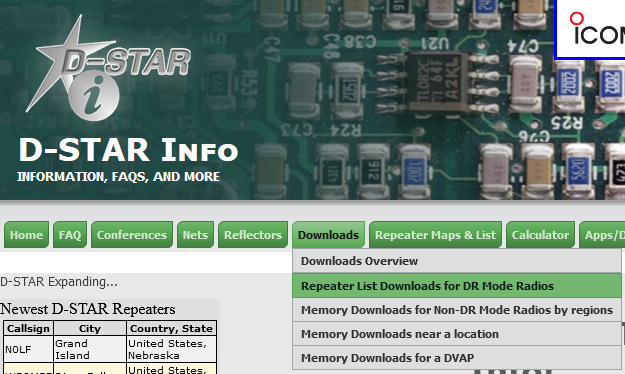
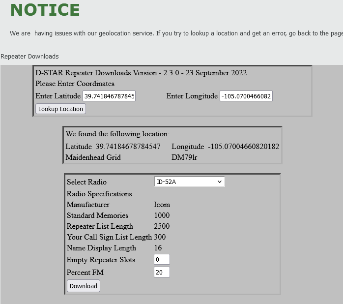

# Downloading DSTAR Repeaters to your radio

Thankfully there is a slick website that generates a comma-separated value (CSV) file you can load onto your radio and — lo and behold — every D-STAR repeater in the world is correctly programmed in.

<!-- more -->

[www.dstarinfo.com](https://www.dstarinfo.com)

Go to **Downloads** > **Repeater List Downloads for DR Mode Radios**

Enter your Latitude and Longitude, select your radio model and click Download.

