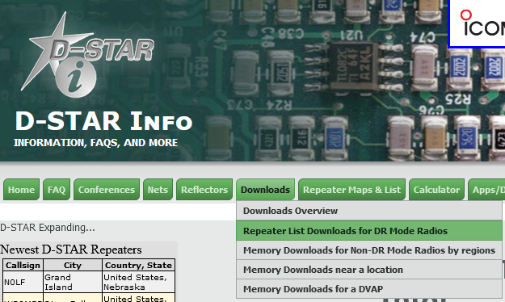

---
date:
  created: 2024-08-16
readtime: 5
pin: true
links:
  slug: dstar
---

# Downloading DSTAR Repeaters to your radio

Thankfully there is a super slick website that will generate a comman separated value (CSV) file that you can copy/paste on your radio and lo and behold every DSTAR repeater in the world is correctly programmed into your radio.

<!-- more -->

[www.dstarinfo.com](https://www.dstarinfo.com)

Go to **Downloads** > **Repeater List Downloads for DR Mode Radios**

Enter your Latitude and Longitude, select your radio model and click Download.

