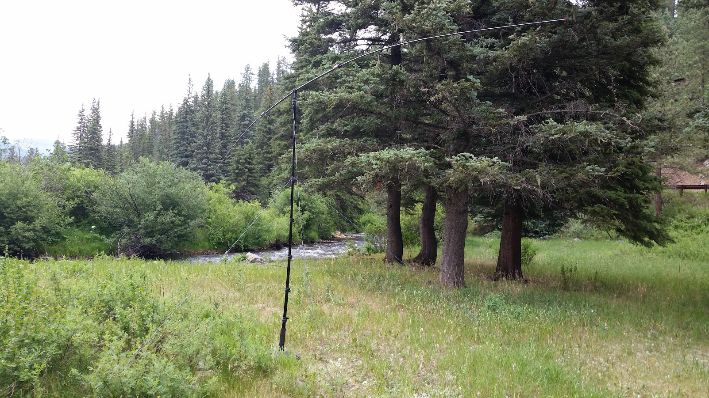

---
date:
  created: 2016-06-25
readtime: 1
pin: true
links:
  slug: field day
---

# Field Day 2016

I operated at the Cabin in Pecos, New Mexico for Field Day 2016.

<!-- more -->

This was my first field day and I lumped it together with a family trip to the cabin so I didn't get much operating time. Between radio difficulties and band conditions I only managed 2 measely contacts all weekend. I used a Buddipole setup with my Icom 7200 HF radio with a tuner.