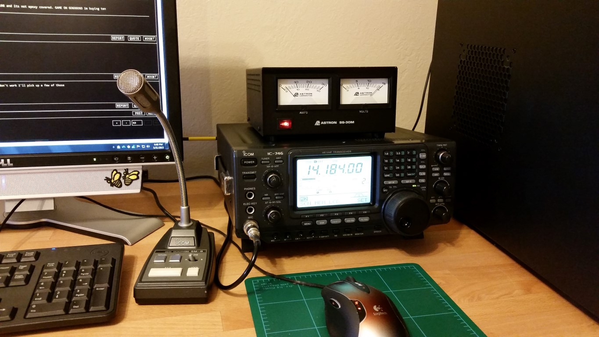

---
date:
  created: 2015-05-31
readtime: 2
pin: true
links:
  slug: ugh
---

# First HF Station

My first HF station, a used Icom-746 bought off Craigslist that came with an Astron SS-30M power supply. Word of advice, don't buy radios off Craigslist..

<!-- more -->

I messed with this radio for weeks not having good luck with contacting stations only to find out the transmitter was fried. It was only putting out about 3 watts of power. After having it repaired I sold it to buy a new Icom 7200 and had much better luck. Still it left a lasting mark because I spent so much time getting absolutely nowhere with making contacts.