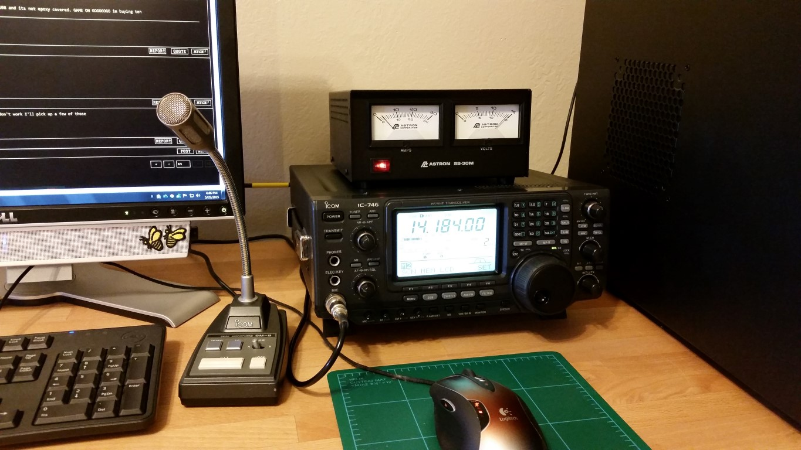

# First HF Station

My first HF station — a used Icom 746 bought off Craigslist that came with an Astron SS-30M power supply. Word of advice: don't buy radios off Craigslist.

<!-- more -->

I messed with this radio for weeks without making a single contact, only to eventually discover the transmitter was fried. It was only putting out about 3 watts. After having it repaired I sold it and bought a new Icom 7200, which worked much better. Still, it left a lasting mark — I spent so much time getting absolutely nowhere that the experience shaped how I approach troubleshooting to this day.