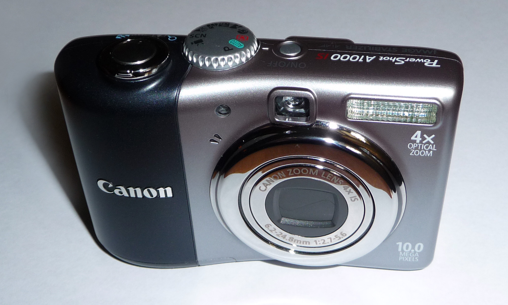
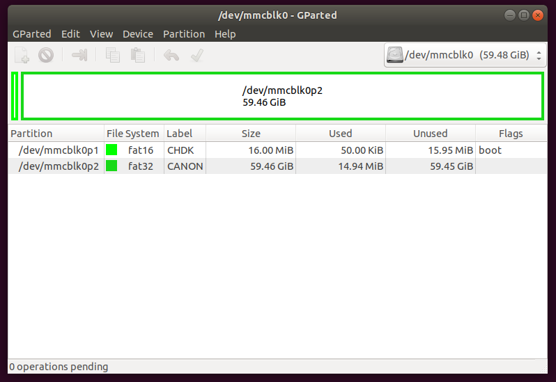
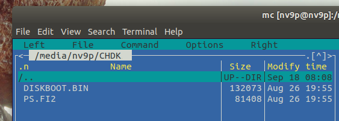
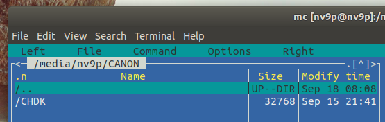

---
date:
  created: 2018-04-16
readtime: 10
pin: true
links:
  slug: hab
---

# High Altitude Balloon Part 1: Cameras


For my high altitude balloon launch, I wanted to send up something a little cheaper than a $400 GoPro camera in the event that I can't locate the balloon when it comes back to earth!

<!-- more -->

So I found a much cheaper alternative that gave me the same level of customization but at a fraction of the price... old Canon cameras running the Canon Hack Development Kit CHDK

For $50 I was able to score two Canon AS1000 point and shoot cameras off eBay and loaded two 64GB flash cards with the latest stable CHDK package (1.41 as of the time of this post)



One camera will be my "still photos" camera and the other will be the "video camera". One of the excellent features of CHDK is the scripting feature. You can copy LUA scripts to the memory card and have them execute a series of functions on the camera. In this case I want the cameras to immediately start recording video once powered on or shooting photos every 5 seconds once powered on.

I found it tricky to install CHDK on the 64GB SD Card I had purchased and found out my cameras were manufactuered in 2008. Everytime I inserted the card to try and format it on the camera it just complained with "Memory Card Error". So after a little digging I found that I could partition the cards in linux, copy the CHDK files on to them and then the cameras would be happy.

First I used GParted in Ubuntu to create the first partition at 16MB as a FAT16 boot partition. After I confirmed the changes I right clicked the partition, went to "Manage Flags" and set this partition as a boo partition. This allows the camera to load up CHDK everytime on power and I don't have to manually activate it each time. Then I created a second partition as FAT32 that took up the rest of the space on the memory card. Here's what my GParted screen looked like after everything was finalized:



Then I had to copy the CHDK files to the camera. I downloaded the latest stable version of CHDK, 1.41 and extracted it on my laptop. Then I copied the DISKBOOT.BIN and PS.F12 files to the first boot patition. Then I copied the CHDK folder to the second partiton. Here are screenshots of each folder and what they should look like:




Finally I ejected the Memory card and write protected the card with the little plastic tab on the side. This step is important! It's what tells the camera to load from the boot partition. Now when you power on the camera the CHDK splashscreen will show after about 3 seconds.

Here's the lua script for continuous still shots of the camera for as long as the battery lasts or until the memory card fills up

```lua
--[[ High Altitude Balloon Camera script for Canon AS1100, still photos
@title Balloon Camera
@param    i Shot Interval
 @default i 5
 @range   i 1 60
@param    d Display
 @default d 0
 @values  d 0 1
--]]

props = require("propcase")
set_console_layout(1 ,1, 60, 15 )
print_screen(-1)
print("HAB Camera")
print(os.date())
sleep(1000)

local is_record, is_video, mode_number
is_record, is_video, mode_number = get_mode()
mode_number = bitand(mode_number, 0xFF)
if (mode_number ~= 2) then
    print("!!! WRONG MODE "..mode_number.." !!!")
    print("!!! WRONG MODE "..mode_number.." !!!")
    print("!!! WRONG MODE "..mode_number.." !!!")
    print("Set P mode and restart camera")
    sleep(10000)
    post_levent_to_ui('PressPowerButton')
end

-- conf.subj_dist_override_koef = SD_OVERRIDE_INFINITY
if (get_config_value(108) ~= 2) then
    print("Enabling distance override")
    set_config_value(108, 2)
    sleep(500)
end

if (is_record == false) then
    print("Switching to photo capture")
    set_record(1)
    while (get_mode() == false) do sleep(100) end
    sleep(1000)
end

print("Setting AF-Lock")
set_aflock(1)
set_prop(props.AF_LOCK, 1)
sleep(1000)

print("Setting focus to infinity")
set_focus(60000)
sleep(3000)

local image_count = 0
print("---")

while(true)
do
    if ((image_count == 3) and (d == 0)) then
        print("Turning off display...")
        sleep(3000)
        set_lcd_display(0)
        sleep(1000)
    end

    image_count = image_count + 1
    local battery_voltage = get_vbatt()
    local temperature = get_temperature(0)
    local disk_kb = get_free_disk_space()
    local disk_mb = disk_kb / 1024

    print("Time: "..os.date())
    print("Battery: "..battery_voltage.." mV")
    print("Temp: "..temperature.." C")
    print("Space: "..disk_mb.." MB")

    if (disk_mb < 10) then
        print("Out of disk space!")
        break
    end

    print("Image: "..image_count)
    press("shoot_half")
    repeat sleep(50) until get_shooting() == true

    local av = get_av96()
    local sv = get_sv96()
    local tv = get_tv96()
    local bv = get_bv96()
    local fc = get_focus()
    print("Exposure: AV="..av.." SV="..sv.." TV="..tv.." BV="..bv)
    print("Focus: "..fc)

    press("shoot_full")
    sleep(500)
    release("shoot_full")

    repeat sleep(50) until get_shooting() == false
    release("shoot_half")

    print("File: "..get_exp_count());
    print("---")

    sleep(i * 1000)
end

print("Power down")
post_levent_to_ui('PressPowerButton')
```

This is the video recording script and it allows you to:

- turn the display on & off by pressing the DISP button or down button,
- halt the script by pressing the MENU button
- restart recording by pressing the SET button.
- zoom in & out by moving the cameras zoom lever
- refocus by "half pressing" the shutter button
- It works on cameras with and without a dedicated video button.

Save it to your SD card with a .lua extension (e.g. vid_ext.lua).

```lua
--[[
********************************
Licence: GPL
(c) msl 2012 - 2014
********************************
@title Extended Video r2
@param a Auto (re)start
@default a 1
@range a 0 1
@param b Time in s 0=max
@default b 0
@range b 0 1800
]]

function StartStopVideo()
    local rec, vid = get_mode()
    local vid_button = get_video_button()
    if rec and vid and vid_button == 0 then
        press("shoot_full")
        sleep(300)
        release("shoot_full")
    elseif rec and vid_button == 1 then
        click("video")
    end
end

function restore()
    if get_movie_status() == 4 then StartStopVideo() end
    cls()
    set_console_layout(0,0,25,5)
    set_console_autoredraw(1)
end

restart = a
record_time = b
BL=0
TC=false
time_start = 0
time_now = 0

set_console_layout(9,1,39,6)
if restart==1 then
    cls()
    print("Automatic Video (Re)Start")
    if record_time > 0 then print("record time:", record_time, "s") end
    sleep(2000)
end
set_console_autoredraw(0)

repeat
    if TC == false and record_time > 0 then
        time_start = get_tick_count()
        TC = true
    end
    cls()
    if restart ~= 1 then print("[SET] Start/Stop Video") end
    print("[DISP]  On/Off Backlight")
    print("[ZOOM]  Zooming")
    print("[MENU]  End")
    console_redraw()
    wait_click(900)
    if is_key("display") or is_key("down") then
        set_backlight(BL)
        if BL == 1 then BL=0 else BL=1 end
    elseif is_key("set") and restart ~= 1 then StartStopVideo()
    elseif is_key("shoot_half") then set_aflock(1)
    elseif is_key("zoom_in")  then press("zoom_in")  while is_pressed("zoom_in")  do sleep(20) end release("zoom_in")
    elseif is_key("zoom_out") then press("zoom_out") while is_pressed("zoom_out") do sleep(20) end release("zoom_out")
    end
    if TC and record_time > 0 then
        if get_tick_count() - time_start >= record_time * 1000 + 2000 then
            StartStopVideo() -- stop video
            TC = false
        end
    end
    status = get_movie_status()
    if (status < 4 or status > 4) and restart == 1 then
        StartStopVideo()
        cls()
        print("Start recording")
        console_redraw()
        sleep(5000)
        if BL == 1 then set_backlight(0) end
    end
until is_key("menu")

restore()
```
