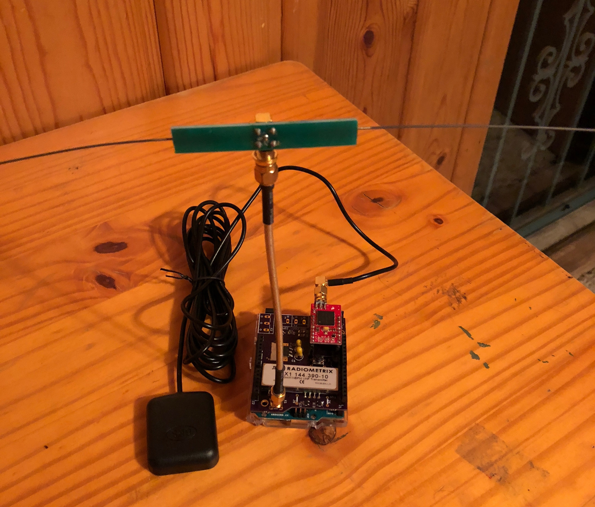
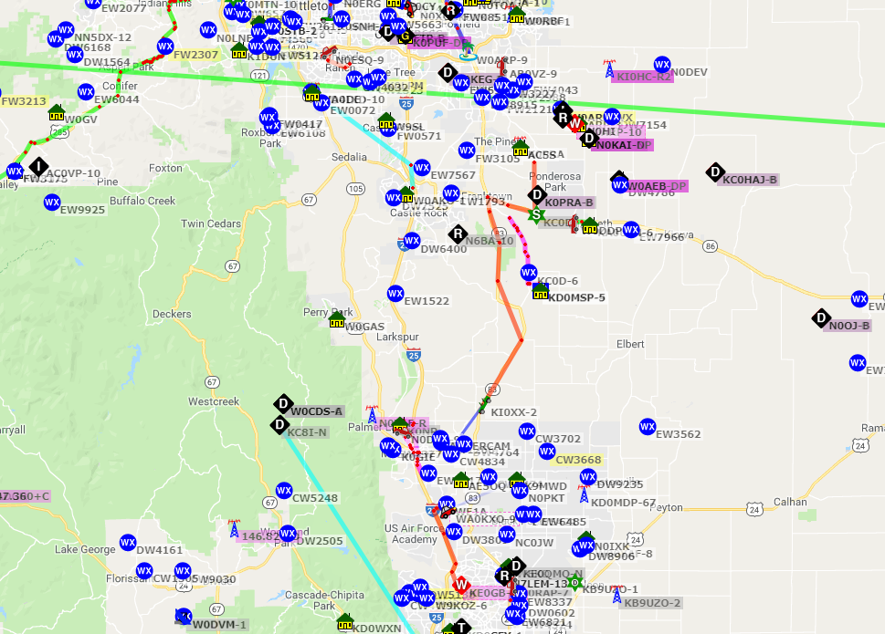

---
date:
  created: 2018-04-26
readtime: 10
pin: true
links:
  slug: hab
---

# High Altitude Balloon Part 2: Trackuino

The most important piece of equipment for the high altitude balloon launch is the Trackuino. This is a quick walkthrough on building the Trackuino and a test drive on APRS.

<!-- more -->

Here's the introduction to what the Trackuino does from its website:
<em>
This is the firmware for Trackuino, an open-source APRS tracker based on the Arduino platform. It was designed primarily to track high altitude balloons, so it has other handy features like reading temperature sensors and a buzzer for acoustic location. Trackuino is intended for use by licensed radio amateurs.
</em>

It's a tiny arduino capable of transmitting data over the 2 meter amateur radio band on 144.390Mhz. That is the general frequency used for APRS, which stands for Automatic Packet Reporting System. It's a way we can use amateur radio frequencies coupled with GPS coordinates to track our balloon in near real time via an chase car radio setup. It can give us telemetry on the balloon like its altitude, speed, temperature and other factors.

Here's the build of materials for the Trackuino

| **Part** | **Source** |
| ----------- | --------------------------------------- |
| Arduino Uno | [https://www.sparkfun.com/products/11224](https://www.sparkfun.com/products/11224) |
| Venus GPS   | [https://www.sparkfun.com/products/11058](https://www.sparkfun.com/products/11058) |
| Trackuino Shield | Bill of materials :arrow_right: [https://github.com/trackuino/shield](https://github.com/trackuino/shield) |
| GPS Antenna |	 |
| V6 Dipole Antenna |	[https://www.byonics.com/antennas](https://www.byonics.com/antennas) |

Here is my finished Trackuino with the Trackuino Shield, Venus GPS, Dipole Antenna and GPS Antenna:

I was able to test the Trackuino by powering it up and waiting for a GPS fix, then it started beaconing out on 144.390Mhz every 60 seconds and showing up on APRS.fi

