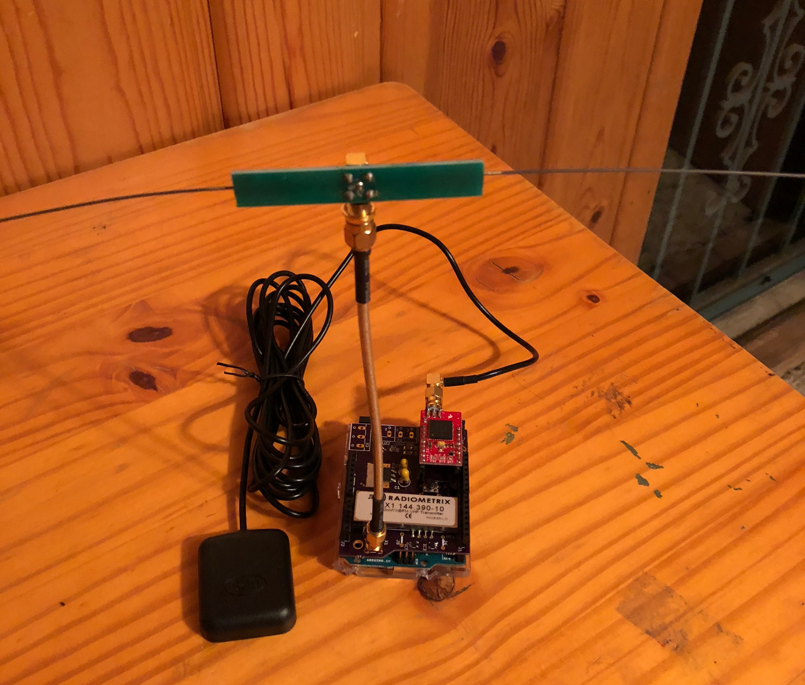
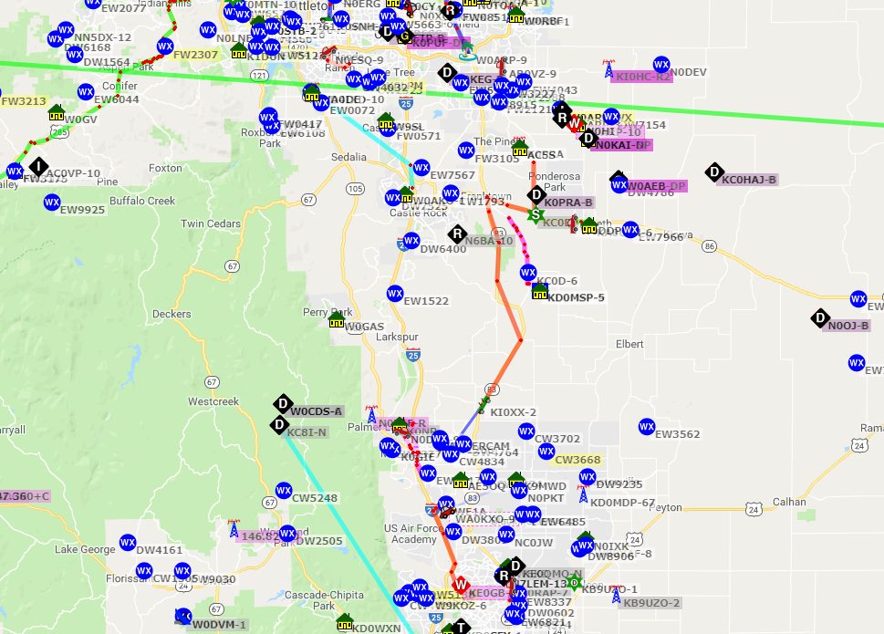

# High Altitude Balloon Part 2: Trackuino

The most important piece of equipment for a high-altitude balloon launch is the Trackuino. This is a quick walkthrough on building the Trackuino and taking it for a test drive on APRS.

<!-- more -->

Here's the introduction to what the Trackuino does from its website:
<em>
This is the firmware for Trackuino, an open-source APRS tracker based on the Arduino platform. It was designed primarily to track high altitude balloons, so it has other handy features like reading temperature sensors and a buzzer for acoustic location. Trackuino is intended for use by licensed radio amateurs.
</em>

It's a tiny Arduino capable of transmitting data over the 2-meter amateur radio band on 144.390 MHz — the standard frequency used for APRS (Automatic Packet Reporting System). APRS lets us use amateur radio frequencies combined with GPS coordinates to track the balloon in near real time via a chase car radio setup. It can give us telemetry like the balloon's altitude, speed, temperature, and more.

Here's the bill of materials for the Trackuino:

| **Part** | **Source** |
| ----------- | --------------------------------------- |
| Arduino Uno | [https://www.sparkfun.com/products/11224](https://www.sparkfun.com/products/11224) |
| Venus GPS   | [https://www.sparkfun.com/products/11058](https://www.sparkfun.com/products/11058) |
| Trackuino Shield | Bill of materials :arrow_right: [https://github.com/trackuino/shield](https://github.com/trackuino/shield) |
| GPS Antenna |	 |
| V6 Dipole Antenna |	[https://www.byonics.com/antennas](https://www.byonics.com/antennas) |

Here is my finished Trackuino with the Trackuino Shield, Venus GPS, dipole antenna, and GPS antenna:

I tested the Trackuino by powering it up and waiting for a GPS fix. Once it had a lock, it started beaconing on 144.390 MHz every 60 seconds and showing up on APRS.fi.

