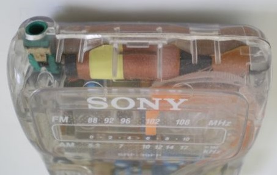

---
date:
  created: 2015-04-11
readtime: 5
pin: true
links:
  slug: interesting
---

# The iPod of Prison

The pocket analog radio, known by the bland model number SRF-39FP, is a Sony “ultralight” model manufactured for prisons. Its clear housing is meant to prevent inmates from using it to smuggle contraband, and, at under thirty dollars, it is the most affordable Sony radio on the prison market.

<!-- more -->

Read more about it here:
[http://www.newyorker.com/tech/elements/the-ipod-of-prison](http://www.newyorker.com/tech/elements/the-ipod-of-prison)