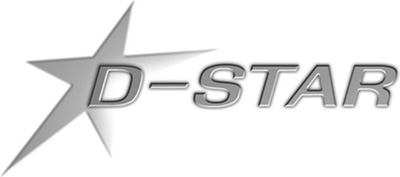
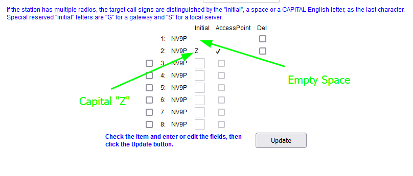

---
date:
  created: 2024-08-24
readtime: 4
pin: true
links:
  slug: dstar
---

# Register for D-STAR

New Callsign Registration is a two-step process.  

## First Step – get an account on a D-STAR gateway

Navigate to [https://regist.dstargateway.org/Dstar.do](https://regist.dstargateway.org/Dstar.do) and click on the Register button.  Enter your callsign in UPPER CASE along with other requested information and a password of your choice.  This will submit your request for approval. You will receive a confirmation email once your request for an account is approved.

## Second Step – Create a “terminal”

Once your account is approved, go back to the above Registration page and under "Already Registered?", enter your callsign (UPPER CASE) and password and click Login.

Then click on the Personal Information tab (upper right of main page).  Each numbered line can be used to set up a terminal.  For your first terminal:

- Click on the check-box on the left of the first line
- Enter a blank (press the space bar) in the Initial box.  This is important.  Don't skip over this field.  Just enter an explicit space into this box.
- Enter a capital "Z" in the second box. Check the "AccessPoint" box.
- Click Update

After you’ve entered your terminal, it sometimes takes several hours for the updates to propagate through the D-STAR network. You can check at:
[https://regist.dstargateway.org/regcheck/index.php](https://regist.dstargateway.org/regcheck/index.php).

## Final Step

Be sure to enter your registered callsign into your radio's MY or MYCALL field.  You must do this before that radio will be able to talk to others on reflectors or connected repeaters.  For nearly everyone, you only need one terminal, even if you have more than one D-STAR radio.  Just use the same registered callsign in MY/MYCALL on all your radios.