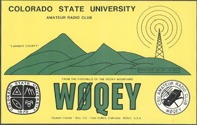
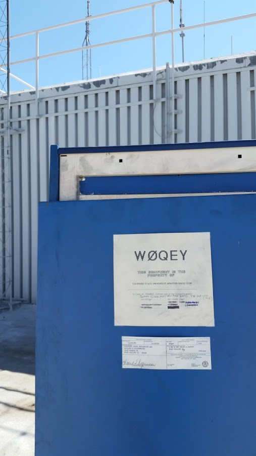
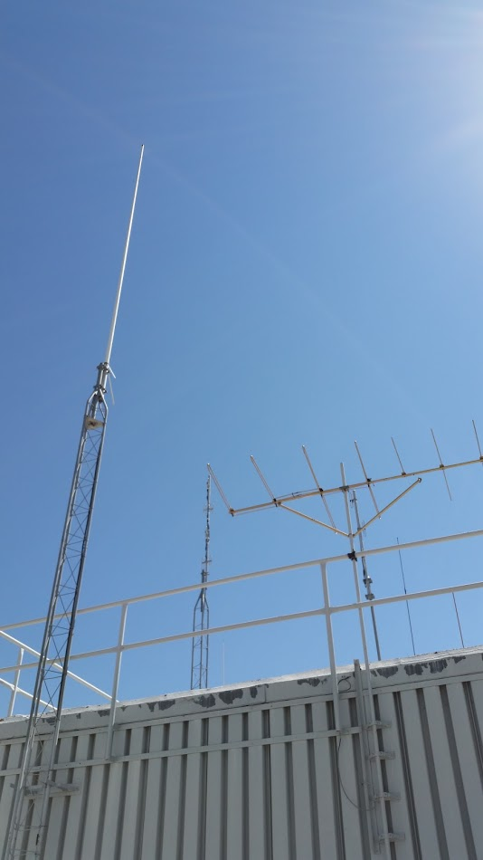

---
date:
  created: 2015-08-01
readtime: 3
pin: true
links:
  slug: repeater
---

# CSU Repeater Maintenance

The local Colorado State University CSU Amateur Radio club was doing some maintenance on their W0QEY repeater and I volunteered to help.

<!-- more -->

Mainly we were just cleaning out old equipment and cleaning the existing equipment. It was fun seeing the guts of a repeater and seeing how the cavities are tuned for clean transmit.

    Frequency: 446.8125- minus
    Location: Fort Collins, CSU Durward Hall
    County: Larimer

