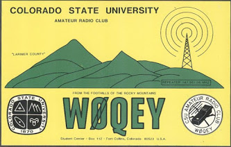
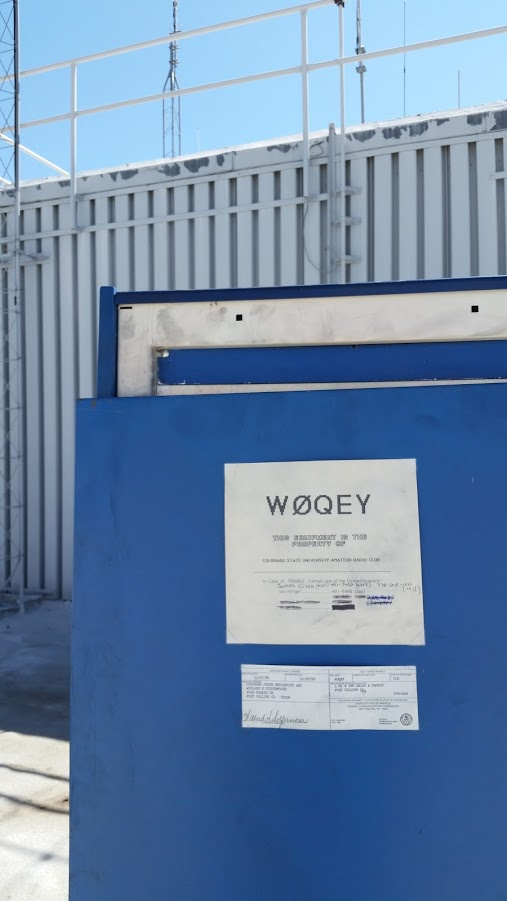
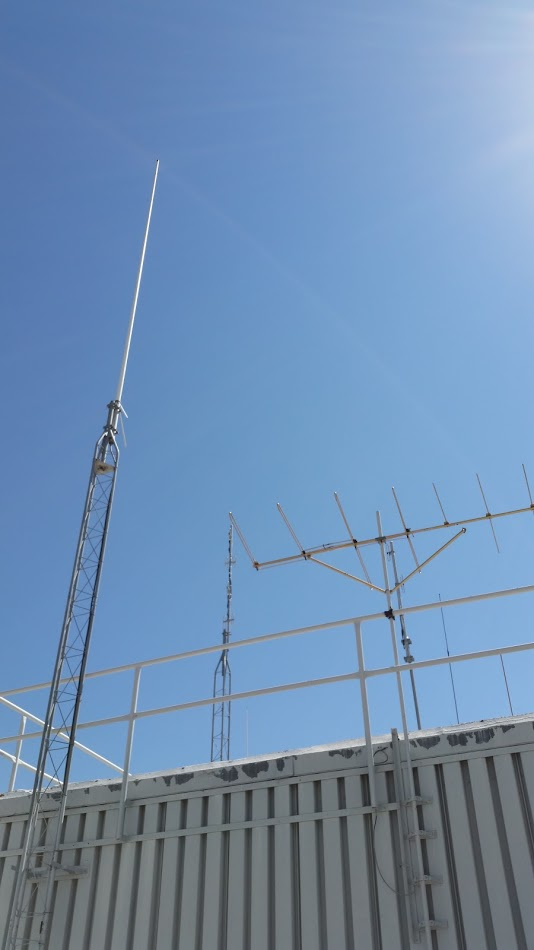

# CSU Repeater Maintenance

The Colorado State University (CSU) Amateur Radio Club was doing maintenance on their W0QEY repeater and I volunteered to help.

<!-- more -->

Mostly we were cleaning out old equipment and tidying up what remained. It was fun seeing the guts of a repeater and learning how the cavities are tuned for clean transmission.

    Frequency: 446.8125- minus
    Location: Fort Collins, CSU Durward Hall
    County: Larimer

