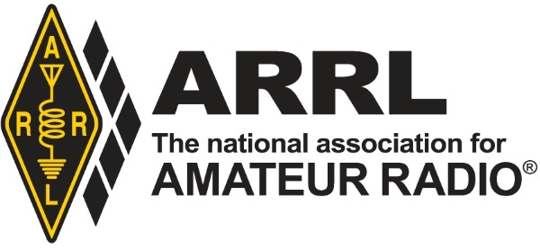
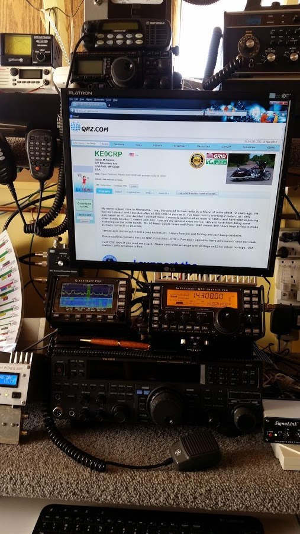
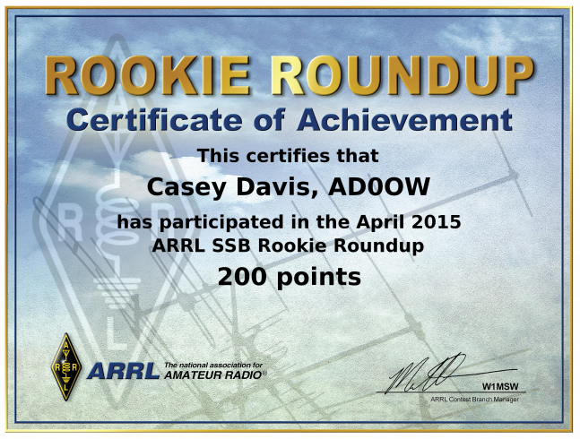

---
date:
  created: 2015-04-08
readtime: 2
pin: true
links:
  - Homepage: index.md#project-layout
  - Blog index: blog/index.md
  - External links:
    - Material documentation: https://squidfunk.github.io/mkdocs-material
slug: contest
---

# ARRL Rookie Roundup 2015

This was my very first attempt at contesting. I participated in the annual ARRL Rookie Roundup this year with the help of John Wells, KB0NE.
<!-- more -->

John was kind enough to share his shack with me and show me the basics of operating in a contest. I didn't score too many points but it was a great afternoon and got me thinking about how to contest more efficiently in the future.

