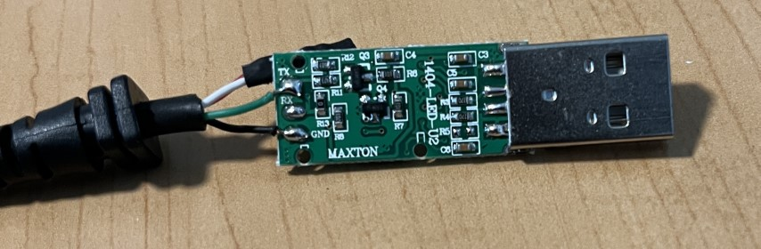
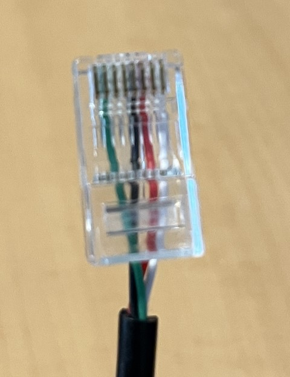

---
date:
  created: 2024-07-28
readtime: 3
pin: true
links:
  slug: motorola
hide:
  - toc
---

# Making a USB Programming Cable for old Motorolas

I have become quite a fan of old Motorola VHF and UHF radios, partially because of Kenneth Finnegan aka [The Life of Kenneth](https://blog.thelifeofkenneth.com/). He showed me all it took was some a little software and a USB to RJ45 adapter to program them and you've got an inexpensive 2meter VHF radio ready for tinkering.

<!-- more -->

So here is a quick and dirty howto to make your own programming cable that works great with Motorola GM300 Maxtrac radios as well as the CDM Series of radio (750/1250).

Start with an FTDI cable/chip, these are readily available off Amazon, eBay, etc. You can see here I have a Maxton Data USB cable with the shell popped off to show the pins:

You can see really all we are working with here is the green wire which is TX and the black wire is Ground. The white and red wires are just shorted together inside the shell, I'm guessing to bring the signal high on the Motorola radio to start/stop programming.

So after some internet searches I finally came up with this configuration on the wires

| Pin 1 | Pin 2 | Pin 3 | Pin 4 | Pin 5 | Pin 6 | Pin 7 | Pin 8 |
| --- | --- | --- | --- | --- | --- | --- | --- |
| | Green | | Black | Red | White | |

Bring out your trusty RJ-45 Ethernet crimper and a standard RJ-45 jack, carefully line up the wires and give it a crimp. Now insert into the front microphone jack of your closest, oldest Motorola radio from the 1990's and you are ready to program.

