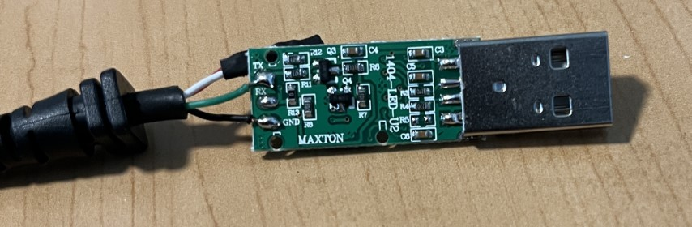
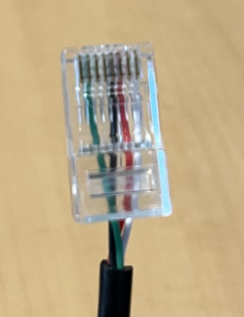

# Making a USB Programming Cable for old Motorolas

I've become quite a fan of old Motorola VHF and UHF radios, largely thanks to Kenneth Finnegan, aka [The Life of Kenneth](https://blog.thelifeofkenneth.com/). He showed me that all it takes is a little software and a USB to RJ-45 adapter to program them, and you've got an inexpensive 2-meter VHF radio ready for tinkering.

<!-- more -->

Here is a quick-and-dirty how-to for making your own programming cable that works great with Motorola GM300 Maxtrac radios as well as the CDM series (750/1250).

Start with an FTDI cable/chip, these are readily available off Amazon, eBay, etc. You can see here I have a Maxton Data USB cable with the shell popped off to show the pins:

Really all we're working with here is the green wire (TX) and the black wire (Ground). The white and red wires are shorted together inside the shell — I'm guessing to bring the signal high on the Motorola radio to trigger the programming mode.

After some searching I finally came up with this wire configuration:

| Pin 1 | Pin 2 | Pin 3 | Pin 4 | Pin 5 | Pin 6 | Pin 7 | Pin 8 |
| --- | --- | --- | --- | --- | --- | --- | --- |
| | Green | | Black | Red | White | |

Grab your trusty RJ-45 Ethernet crimper and a standard RJ-45 plug, carefully line up the wires, and give it a crimp. Now plug it into the front microphone jack of your old Motorola and you are ready to program.

