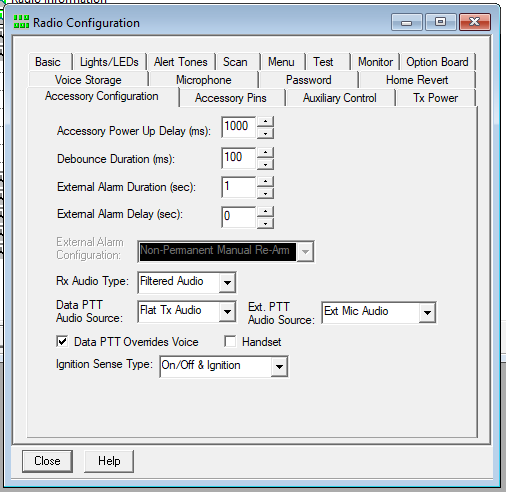
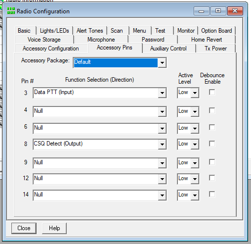
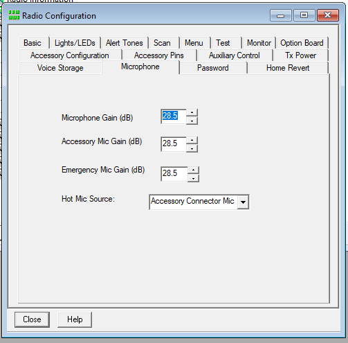
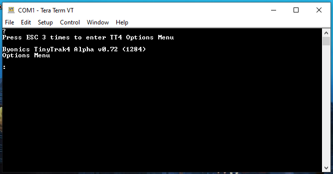
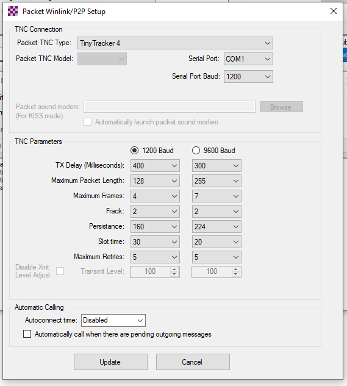
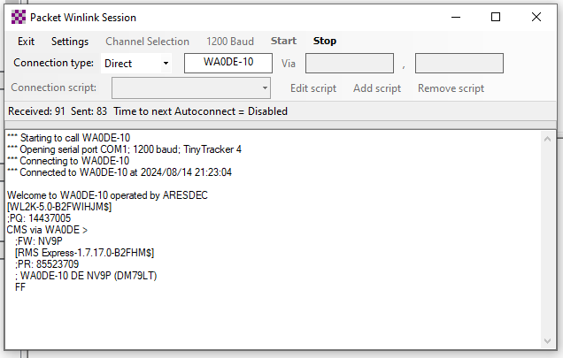

---
date:
  created: 2024-08-14
readtime: 25
pin: true
links:
  slug: packet
---

# Winlink Express using Tinytrack4 and Motorola


I'm not really sure why but when I was first learning about all the different aspects of ham radio I always thought sending an e-mail over Winlink Express was the coolest thing. I believe I read about sailors circumnavigating the world on sailboats and one of them used their VHF radio onboard to send e-mail to let their family and friends they were okay. No Starlink, just packet radio!

<!-- more -->

Really these instructions are more of a reminder for me because I have stumbled through this setup twice now before I got around to documenting the process. Big thanks to [N3LUD](http://n3lud.blogspot.com) for pointing me in the right direction with this project.

## Program the Motorola CDM1250 Radio

So this topic has been beat to death about interfacing with Motorola radios using the Accessory Pin connector but I had such a hard time with it I wrote several articles walking through the process. Hopefully I was save some poor soul hours of their life.

[Making a USB programming cable for older Motorola Radios](usb-programming-cable-motorola.md)

[TODO Making an TNC interface cable for older Motorola Radios](Making an TNC interface cable for older Motorola Radios)

Okay after you have cleared those two hurtles, you can begin to program the radio using the Motorola CPS programming software.

1. Under **Accessory Configuration** I had to use **Filtered Audio** and **Data PTT Overrides** Voice in order for my TinyTrack4 to hear the packets through the radio and transmit out

    

2. The way I built my interface cable corresponded to the options I chose here. I put the **Push to Talk (PTT)** on Pin 3 on the Motorola Accessory Connector and the **Carrier Squelch Detect (CSQ)** on Pin 8.

    

3. Finally here I set the Hot Mic Source to **Accessory Connector Mic**

    

4. My last step was going into Radio Personalities and configuring a "Winlink" channel that was just a Transmit and Receive channel using CSQ on 144.990MHz.

## Program the parameters on the Byonics TinyTrack4

1. Download and install TeraTerm, this has been a great software for working with serial devices like the TinyTrack4 TNC.
2. Setup a connection for the correct COM port and a baud rate of 19200.
3. Plug your computer's null modem cable into the TinyTrack4 and apply power.
4. You should see the option to press ESC three times to enter the options menu. **Press ESC three times.**

    

5. If you are like me you have tried a million combinations of settings so you might want to default your TinyTrack4 by using the **restore** command.
6. At the command prompt enter the following commands.

    - MYCALL NV9P
    - AMODE KISS
    - ABAUD 1200
    - RXAMP 5

7. Type **quit** and press Enter. Close TeraTerm to free up the serial port so Winlink Express can connect to it.

Here was my final configuration on the TinyTrack4

```bash
BANK is 0
P300 is FALSE
TXTDISP is FALSE
NODISP is FALSE
PPATHING is FALSE
DMSDISP is FALSE
MICETMV is FALSE
ENTS is FALSE
TELHIRES is FALSE
TELVOLT is TRUE
TELTEMP is TRUE
PREEMPT is FALSE
DIGIID is TRUE
WXPOS is TRUE
TELREAD is TRUE
FRAWDISP is FALSE
HRAWDISP is FALSE
WYPTXT is FALSE
PKTICOM is TRUE
PKTOCOM is FALSE
RPATHDISP is FALSE
LEDS is TRUE
PAVPEN is FALSE
DEC96 is FALSE
DDIST is FALSE
HEADERLN is FALSE
DMETRIC is FALSE
SOFTRST is TRUE
MSGCMD is FALSE
MSGCAP is FALSE
LRNTPS is FALSE
GPSCHK is FALSE
INTCLK is FALSE
DECSTAT is FALSE
DIGIMY is FALSE
TOSV is TRUE
TALT is TRUE
TSPEED is TRUE
TIMESTAMP is TRUE
TIMEHMS is TRUE
SBEN is FALSE
TSWPT is TRUE
AMODE is KISS
BMODE is GPS
ABAUD is 1200
BBAUD is 4800
BNKMODE is 0
SSIDROUTE is 0
ALTNET is APTT4
MYCALL is NV9P
PATH1 is WIDE1-1
PATH2 is WIDE2-1
PATH3 is
TSTAT is /TinyTrak4 Alpha
BTEXT is >/TinyTrak4 Alpha
BPERIOD is 0
TXD is 40
MTXD is 10
PERSIST is 65
SLOTTIME is 15
QUIET is 10
TRNKMODE is 0
CDMODE is TONES
CDLEVEL is 20
TXLEVEL is 128
TXTWIST is 50
RXAMP is 5
GWAYLEN is 9
GWAYMODE is NMEA
GRELAYBITS is 1
GRELAYRATE is 0
GKRELAY is 0
LOCATION is 1234.5678N 12345.6789W
GALT is 1000
TSYMCODE is >
TSYMTABLE is /
STATUSRATE is 1
PPERIOD is 0
MPPERIOD is 0
SBSSPEED is 5
SBFSPEED is 60
SBSPERIOD is 1800
SBFPERIOD is 90
SBTANGLE is 27
SBTSLOPE is 255
SBTTIME is 5
MMSG is 0
TSOFFSET is 17
TDAO is 0
TPROTOCOL is MIC-E
TPSWITCH is 0
TPERIOD is 0
TVOLTTWK is 128
TTEMPTWK is 128
WPERIOD is 0
ALIAS1 is TEMP
ALIAS2 is
ALIAS3 is
DUPETIME is 30
FILTERCALL is
TXFREQ is 144.390
RXFREQ is 144.390
RXSQUELCH is 0
```

## Program Winlink Express

1. Run RMS Express. Select Packet WL2K in the drop down menu at the top of the screen.
2. Click on Open Session to the left of the drop down menu.
3. Click Setup to get to the packet configuration screen.
4. Select Tiny Tracker 4 in the Packet TNC Type drop down menu. Select the correct serial port and 1200 for the baud rate and click the Update button.

    

5. In the Packet Winlink 2000 Session window, enter the name of the Winlink RMS station you are trying to connect to. In my case it was WA0DE-10.

6. Make sure your radio is tuned to the correct frequency, in my case it was the "Winlink" channel I programmed on the Motorola for 144.990MHz.

7. Your PC should connect to the RMS station and start sending / receiving data. Success!

    