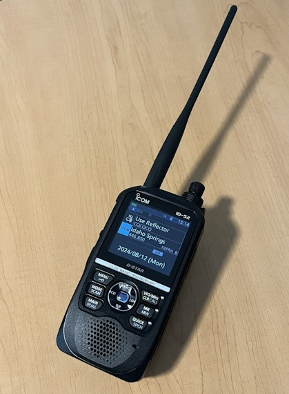

# NV9P Amateur Radio :fontawesome-solid-walkie-talkie:

Welcome to the website of the radio station NV9P. On these pages I try and share some of my amateur radio experiences and related projects. I should probably mention up front that I am a self taught electronics enthusiast and that's probably being too generous. Amateur radio caught my eye in 2013 and I had no idea how unforgivingly difficult it would be for me muddling through every step of the way. There is an intense learning curve and oftentimes it takes me dozens of attempts before I get something even close to success. However it is really satisfying when you finally do make a breakthrough but be warned those are few and far between.

## Here are some projects I have been tinkering with lately

### Using D-Star with an Icom ID-52a handheld radio

This has been my journey using D-Star so far:

- [Registering your callsign for a D-Star](blog/posts/register-for-dstar.md)
- Downloading the D-STAR repeater list into your HT
- D-STAR Basics: Linking, Unlinking, Echotest

### Packet Radio over 2 meter

For this project I had to overcome several hurdles:

- Build a USB programming cable for the Motorola CDM1250 VHF radio
- Build a interface cable from the radio to the Byonics TinyTrack4 TNC
- Modify a Astron SS-25 power supply to use Anderson Powerpole connectors
- Learn about specific details relating to APRS and how to configure a TNC